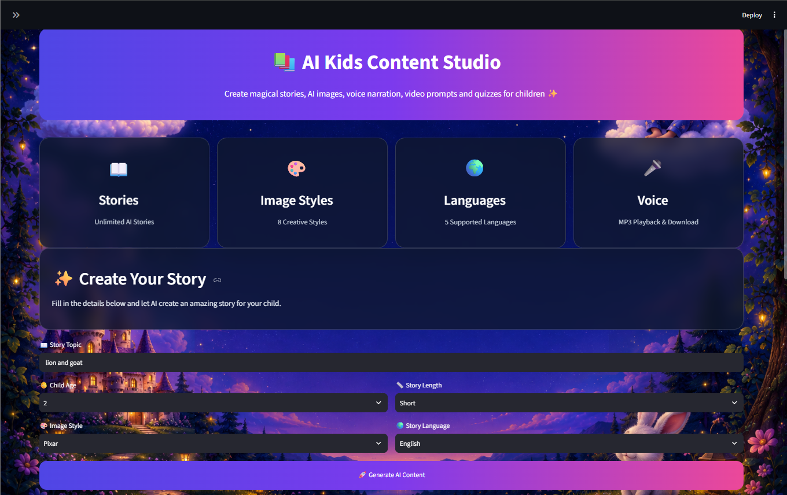
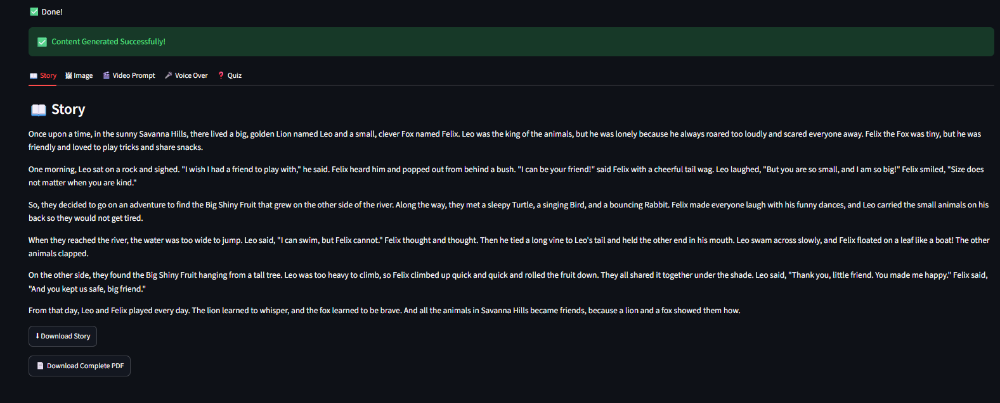
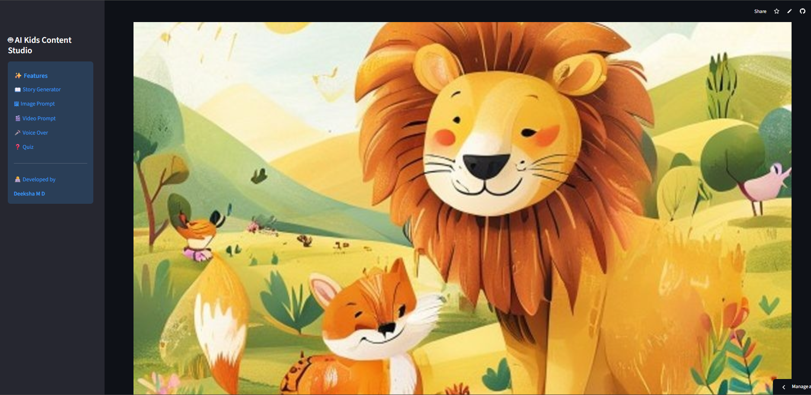
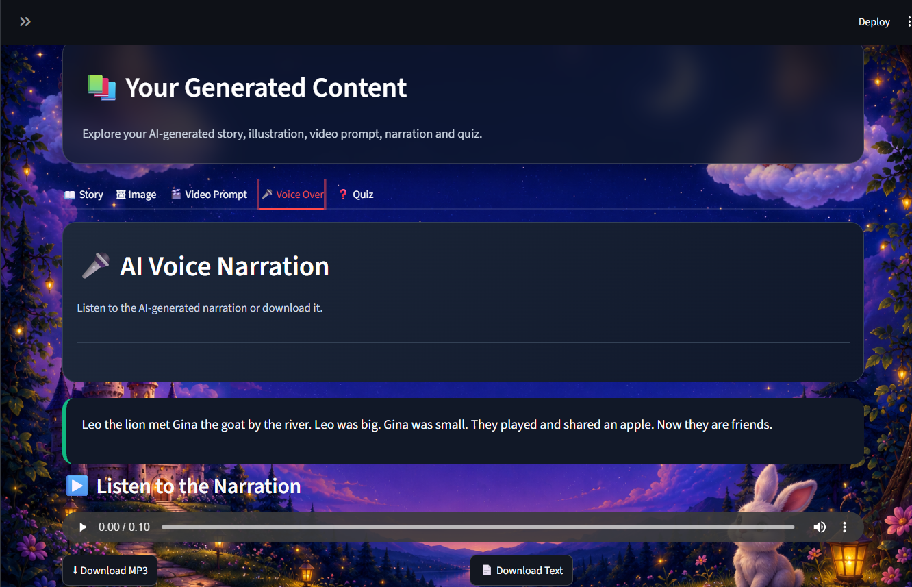
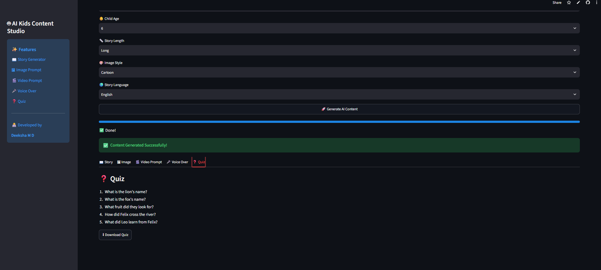

# 📚 AI Kids Content Studio

<p align="center">


</p>

<p align="center">

An AI-powered web application that creates engaging children's educational content including stories, AI-generated illustrations, voice narration, quizzes, video prompts, and downloadable PDFs.

</p>

---

# 🌐 Live Demo
https://ai-kids-content-studio-wfwyg6yctcdwcfrowbyyqw.streamlit.app/

🔗 **https://YOUR-STREAMLIT-LINK.streamlit.app**


---

# ✨ Features

✅ AI Story Generator

✅ AI Image Generation

✅ AI Video Prompt Generator

✅ AI Voice Narration (MP3)

✅ Quiz Generator

✅ PDF Story Download

✅ Multiple Image Styles

✅ Multi-language Support

✅ Responsive User Interface

✅ Cloud Deployment using Streamlit

---

# 🌍 Supported Languages

- 🇬🇧 English
- 🇮🇳 Hindi
- 🇮🇳 Kannada
- 🇮🇳 Tamil
- 🇮🇳 Telugu

---

# 🎨 Available Image Styles

- Pixar
- Disney
- Cartoon
- Anime
- Watercolor
- Storybook
- 3D Render
- Realistic

---

# 🛠 Tech Stack

| Category | Technologies |
|----------|--------------|
| Programming | Python |
| Web Framework | Streamlit |
| AI Content | OpenRouter API |
| AI Images | Pollinations AI |
| Voice | gTTS |
| PDF | ReportLab |
| Image Processing | Pillow |
| HTTP Requests | Requests |
| Version Control | Git & GitHub |
| Deployment | Streamlit Community Cloud |

---

# 📸 Screenshots

## 🏠 Home Page



---

## 📖 AI Story Generation



---

## 🖼 AI Generated Image



---

## 🎤 Voice Narration



---

## ❓ Quiz Generation



---

# 🚀 Installation

Clone the repository

```bash
git clone https://github.com/DeekshaMD15/AI-Kids-Content-Studio.git
```

Go to the project folder

```bash
cd AI-Kids-Content-Studio
```

Install dependencies

```bash
pip install -r requirements.txt
```

Run the application

```bash
streamlit run app.py
```

---

# 📂 Project Structure

```
AI-Kids-Content-Studio
│
├── images/
│   ├── home.png
│   ├── story.png
│   ├── image.png
│   ├── voice.png
│   └── quiz.png
│
├── generated/
│
├── app.py
├── utils.py
├── prompts.py
├── requirements.txt
├── README.md
└── .gitignore
```

---

# ⚙️ How It Works

1. Enter a story topic.
2. Select the child's age.
3. Choose the story length.
4. Select an image style.
5. Choose the preferred language.
6. Click **Generate AI Content**.
7. The application generates:
   - 📖 Story
   - 🖼 AI Image
   - 🎬 Video Prompt
   - 🎤 Voice Narration
   - ❓ Quiz
   - 📄 Downloadable PDF

---

# 🔮 Future Enhancements

- 📚 Story Library
- 👦 Character Selection
- 📖 Storybook Cover Page
- 🎬 AI Story Video Generation
- 👤 User Login & Saved Stories
- ☁️ Cloud Storage Integration

---

# 💡 Key Highlights

- AI-powered educational content generation
- Multilingual story creation
- Customizable illustration styles
- MP3 voice narration
- Interactive quiz generation
- Professional responsive UI
- Cloud deployment
- Downloadable PDF storybooks

---

# 👩‍💻 Developer

## **Deeksha M D**

🎓 B.E. in Electronics & Communication Engineering

💻 AI • Machine Learning • Python Developer

📍 Mysuru, Karnataka, India

---

# ⭐ Support

If you found this project useful,

⭐ **Please give this repository a Star!**

It motivates me to build more AI-powered applications.

---

# 📜 License

This project is licensed under the **MIT License**.
